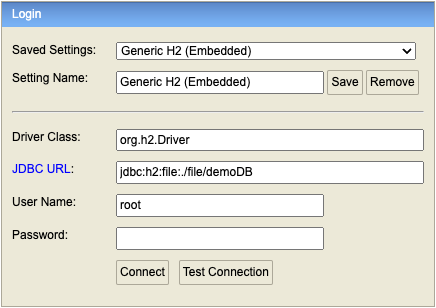

# Introduction  

Side Project

# Getting Started
1. to entry Swagger , please add "/swagger" after http://localhost:9000
2. to entry Spring H2 Console , please add "/h2-console" after http://localhost:9000
   - JDBC URL  : jdbc:h2:file:./file/demoDB
   - User name : root
   - 

# Build and Run

1. mvn clean install
2. mvn spring-boot:run

##### IT人員：

- 平台畫面開發：`棠棠`、`豆豆`、`Hana`、`Dana`
- 後端技術：`球哥`
- 後端指導：`球哥`

##### UIUX人員

- `Dory`